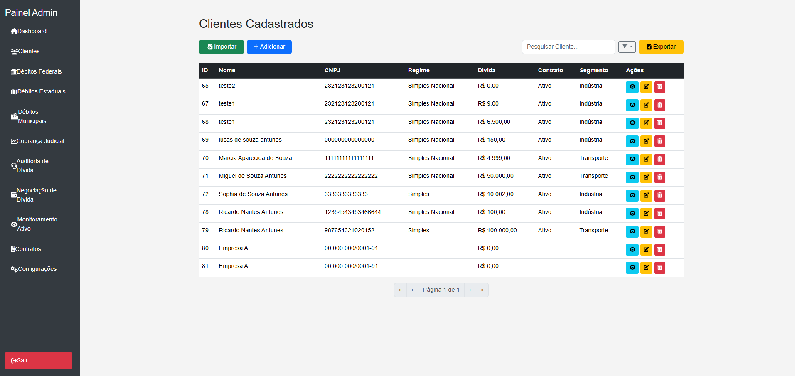
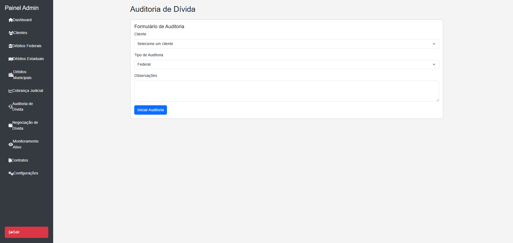
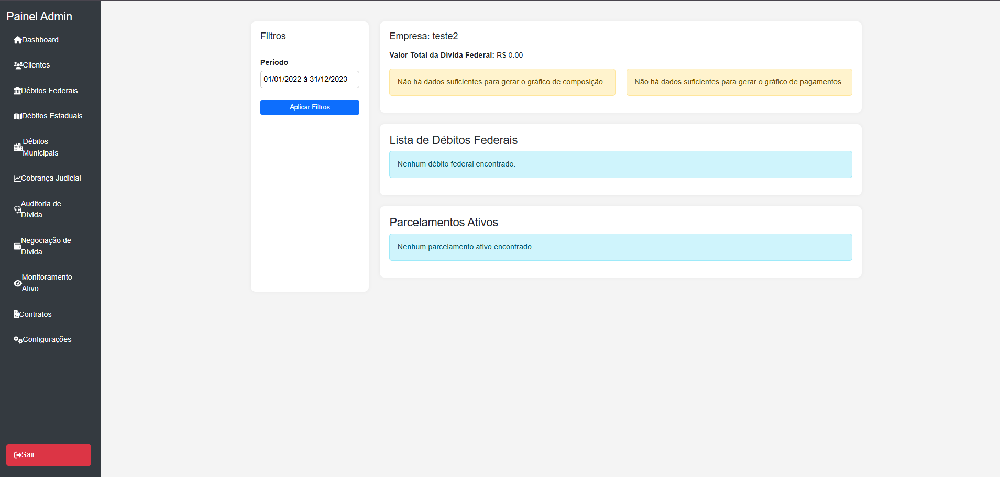
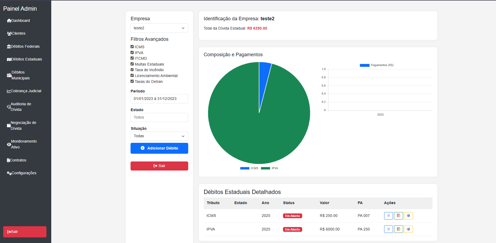
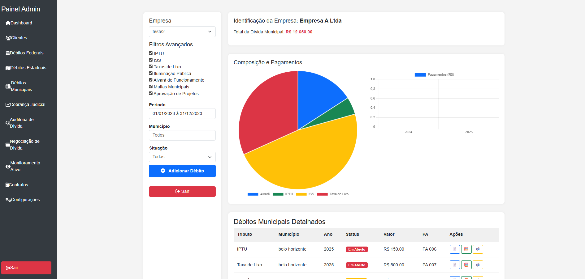

# 🏛️ Patrimonialis – Fiscal Management System
> ⚠️ This project is currently under development.

A full-featured platform for fiscal and asset management, designed to assist administrators and clients in tracking debts, legal processes, and financial negotiations efficiently and securely.

---

## 🚀 Tech Stack

`Flask` · `Python` · `JavaScript` · `PostgreSQL` · `HTML/CSS` · `Bootstrap` · `TailwindCSS`

---

## 🔧 System Status

🚧 This project is currently under active development. Features and UI are subject to refinement.

---

## ⚙️ Core Features

### 🔒 Admin Panel

- **Management Dashboard**: Track clients, total debt value, active legal processes, and weekly events.
- **Clients**: Register, update, delete, and export clients with detailed info (CNPJ, contract, address, etc).
- **Debts**: Filter by type (federal, state, municipal), simulate payments, and track remaining balances.
- **Processes**: Follow legal and administrative processes with history and movement logs.
- **Notifications**: Send reminders and system alerts to clients.
- **Negotiations**: Manage proposals and agreements with history tracking.
- **Authentication**: Secure login/logout and role-based access.
- **Admins**: Admin registration via auth code.

### 👤 Client Panel

- **Dashboard**: Personal summary of debts, processes, and negotiations.
- **Debt Visualization**: Filter debts by type, region, status, and simulate payments.
- **Negotiations**: View offers, accept proposals, and track agreement status.
- **Processes**: Full process history and tracking.
- **Notifications**: Receive important messages from administrators.
- **Authentication**: Client registration and login.

### 🌐 General

- **Responsive Design**: Optimized for mobile and desktop devices.
- **Secure Access**: Session control and profile differentiation (admin vs client).
- **Import/Export**: Export to Excel/CSV, and (soon) import clients via file upload.

---

## 🖼️ Screenshots

> Below are some illustrative screens of the system in use.

### 🔐 Admin Login  

### 🔐 Client Login  

### 🧭 Admin Dashboard  

### 📊 Client Dashboard  

### 🧾 Clients Listing  

### 📥 Debt Auditing  

### 💰 Federal Debts  

### 🏛️ State Debts  

### 🏘️ Municipal Debts  

---

## 📩 Contact

---

💡 *Let’s build something great together.*

<!-- updated by Lucas on July 10 -->
